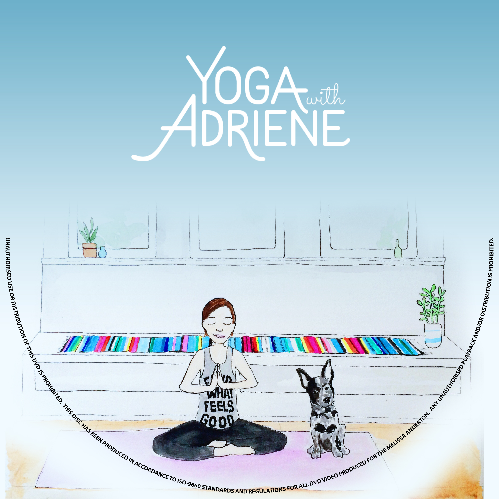
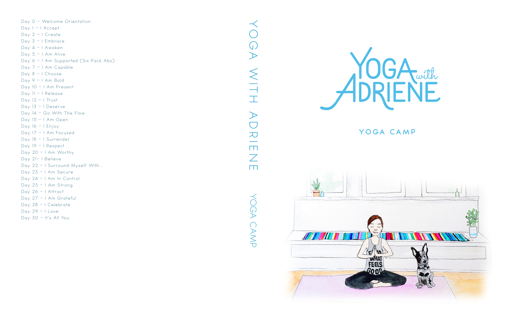

# DVD label design

## [Yoga with Adriene](https://www.youtube.com/user/yogawithadriene)

I wanted to create some DVD cases, disc labels, and try out in the package creation.

### Disc label

The `.btw` file automatically crops the disc outline, and the centre hole.

There is also a merge field on the file to input free text.

### DVD cases

#### Assorted videos

#### Revolution: 31 Days of Yoga

#### Yoga Camp

